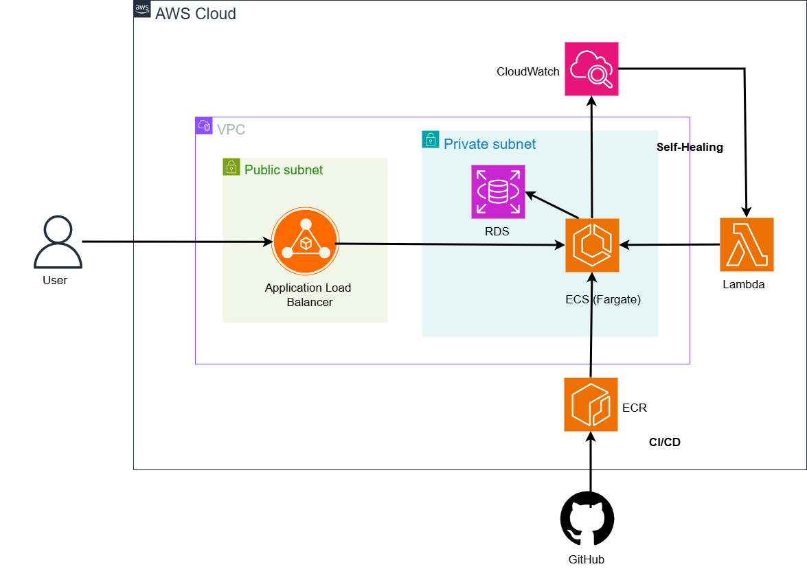
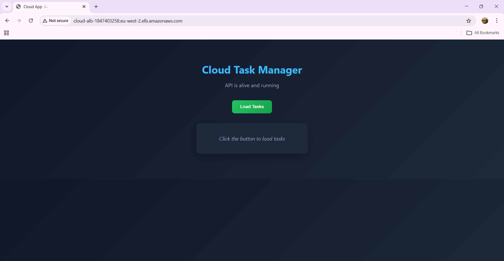
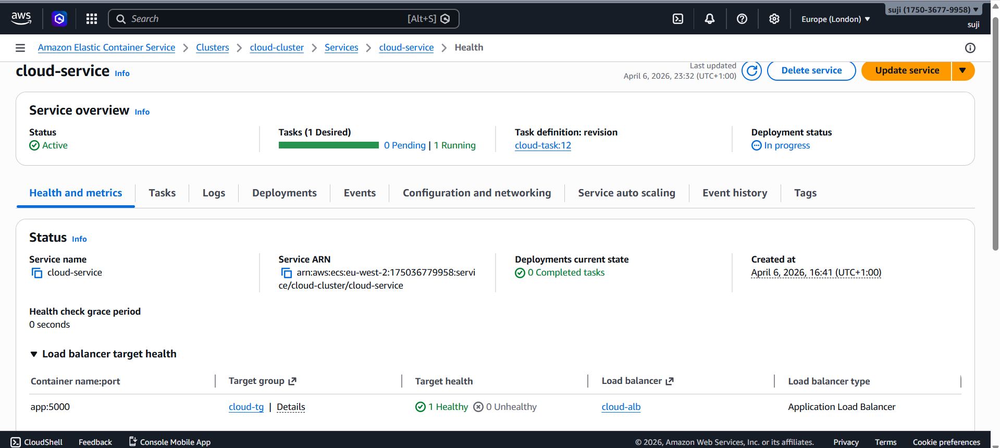
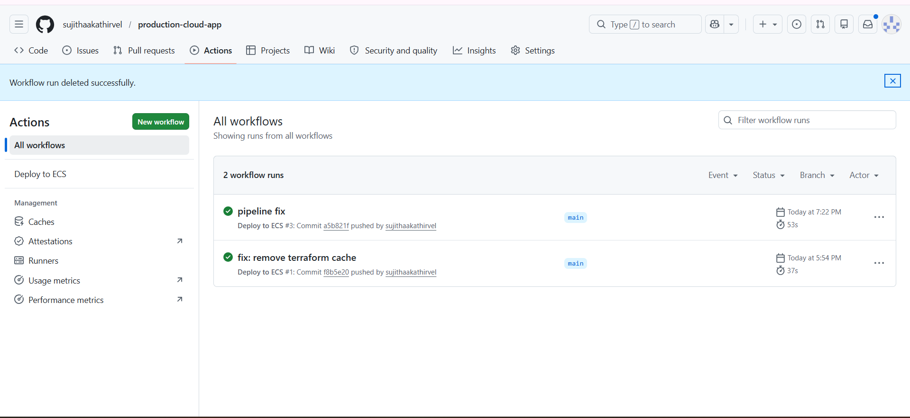
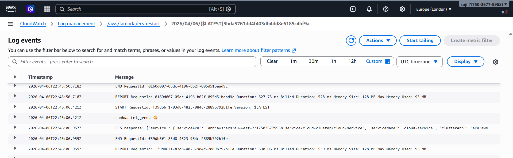

# Production-Cloud_App

A production-style cloud application built on AWS demonstrating containerized deployment, infrastructure as code, CI/CD automation, and a self-healing architecture.

---

##  Architecture Overview

---

## Tech Stack

- AWS ECS (Fargate)  
- AWS RDS (PostgreSQL)  
- AWS Application Load Balancer  
- AWS ECR  
- AWS CloudWatch + Lambda  
- Terraform (Infrastructure as Code)  
- Docker  
- GitHub Actions  

---

## Key Features

- Containerized backend deployed on ECS Fargate  
- Infrastructure fully managed using Terraform  
- CI/CD pipeline using GitHub Actions  
- Load balancing via Application Load Balancer  
- Monitoring with CloudWatch  
- **Self-healing system using Lambda triggers**

---

## Screenshots

### App Running

### ECS Running

### CI/CD Pipeline

### Self-Healing Proof

---

## Key Highlight

> Implemented an automated self-healing mechanism where CloudWatch alarms trigger a Lambda function to restart ECS services during failures.

---

## How It Works

1. User request hits Application Load Balancer  
2. ALB routes traffic to ECS containers  
3. ECS interacts with RDS database  
4. CI/CD pipeline builds and deploys updates  
5. CloudWatch monitors system metrics  
6. Lambda triggers recovery during failures  

---

## Outcome

- Fully automated deployment pipeline  
- Scalable and production-style architecture  
- Fault-tolerant system with self-healing capability  

---