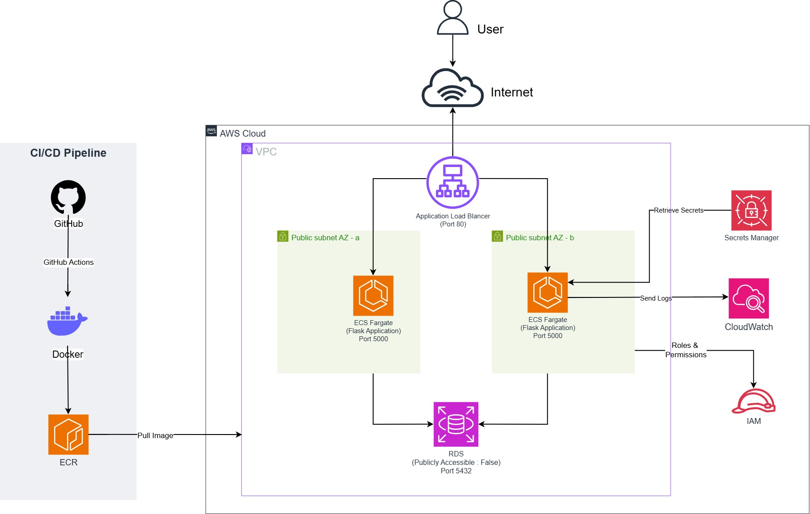
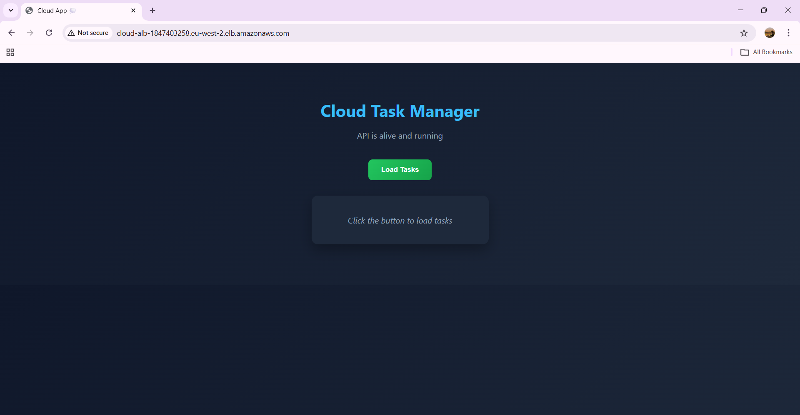
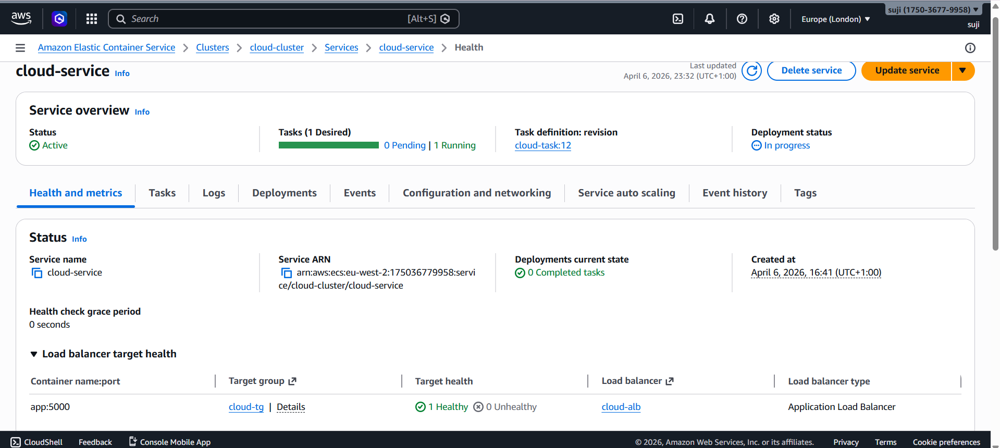
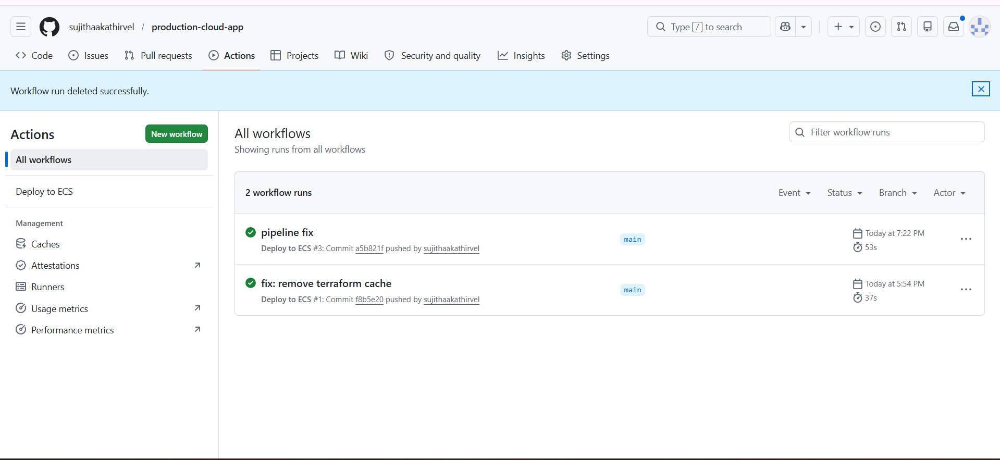

# Production Cloud Application on AWS

A production-style containerized Flask application deployed on AWS to demonstrate Infrastructure as Code, container orchestration, CI/CD, secure networking, monitoring, performance testing, and failure recovery.

---

## Architecture



The application runs inside an AWS VPC across two Availability Zones.

**Traffic flow:**

```text
Internet
   ↓
Application Load Balancer :80
   ↓
ECS Fargate :5000
   ↓
RDS PostgreSQL :5432
```

- Application Load Balancer receives public HTTP traffic.
- ECS Fargate runs the containerized Flask application.
- RDS PostgreSQL provides the database layer.
- RDS is configured with `publicly_accessible = false`.
- Security groups restrict communication between each layer.
- ECS tasks run in the public subnets with public IPs, but direct application access is restricted by security groups.

## Tech Stack

**AWS**
- Amazon VPC
- Application Load Balancer
- Amazon ECS Fargate
- Amazon ECR
- Amazon RDS PostgreSQL
- AWS Secrets Manager
- Amazon CloudWatch
- AWS IAM

**DevOps & Testing**
- Terraform
- Docker
- GitHub Actions
- Apache JMeter
- AWS CLI

**Application**
- Python
- Flask
- PostgreSQL

## Key Features

- Containerized Flask application deployed on ECS Fargate
- Infrastructure provisioned using Terraform
- Docker images stored in Amazon ECR
- Application traffic routed through an Application Load Balancer
- PostgreSQL database hosted on Amazon RDS
- Database password retrieved from AWS Secrets Manager
- ECS application logs sent to CloudWatch Logs
- Automated CI/CD pipeline using GitHub Actions
- ECS task failure recovery tested
- ECS horizontal scaling tested
- Application performance tested with Apache JMeter

## Security

Security groups enforce layered access between the application components:

- **ALB Security Group:** allows HTTP traffic on port 80 from the internet.
- **ECS Security Group:** allows port 5000 only from the ALB security group.
- **RDS Security Group:** allows PostgreSQL traffic on port 5432 only from the ECS security group.
- RDS is configured with `publicly_accessible = false`.
- Database credentials are stored in AWS Secrets Manager rather than hardcoded in the application.
- ECS retrieves the database password using its IAM task execution role.
- Terraform state and generated performance results are excluded from Git.

## Engineering Decisions & Challenges

### Secure Database Credentials

During development, the application initially used a hardcoded database password.

This was refactored so the Flask application reads the database password from the ECS container environment, while the actual secret value is stored in AWS Secrets Manager.

```text
AWS Secrets Manager
        ↓
   ECS Task
        ↓
   Flask App
        ↓
 PostgreSQL
```

This removed the hardcoded credential from the application source code and introduced a more appropriate secret-management pattern.

### Network Access

RDS was configured with:

```text
publicly_accessible = false
```

Although ECS tasks run in public subnets, direct access to the application container is restricted through security groups.

Only the ALB security group can access ECS on port 5000, while RDS accepts PostgreSQL connections only from the ECS security group.

### Terraform & AWS Permissions

During deployment, Terraform encountered AWS Secrets Manager permission issues involving secret creation and resource-policy access.

The required IAM permissions were investigated and corrected, after which the infrastructure deployed successfully.

The restored Secrets Manager secret was also imported into Terraform state to bring the existing AWS resource under Terraform management.

## CI/CD

The deployment pipeline is triggered when changes are pushed to the main branch.

```text
GitHub
   ↓
GitHub Actions
   ↓
Docker Build
   ↓
Amazon ECR
   ↓
Register ECS Task Definition
   ↓
Update ECS Service
```

The workflow:

1. Checks out the repository.
2. Builds the Docker image.
3. Tags the image using the Git commit SHA.
4. Pushes the image to Amazon ECR.
5. Registers an updated ECS task definition.
6. Updates the ECS service with the new deployment.

Recorded GitHub Actions deployment: **43 seconds**.

## Performance Testing

Apache JMeter was used to test the application through the public Application Load Balancer.

**Test Configuration**
- 10 concurrent users
- 10 requests per user
- 100 total requests
- `/health` endpoint

**Results**

| Metric | Result |
|---|---|
| Requests | 100 |
| Error rate | 0% |
| Average response time | 11.94 ms |
| Median | 10 ms |
| P95 | 24 ms |
| Minimum | 7 ms |
| Maximum | 69 ms |
| Throughput | 22.02 req/s |

This was a small-scale performance test intended to validate application behaviour rather than represent production-scale load.

## Reliability & Scaling Tests

### ECS Failure Recovery

An ECS task was intentionally stopped to simulate a container failure.

The ECS service detected that the running task count was below the desired count and launched a replacement task.

The replacement:
- Reached the Running state
- Registered with the Application Load Balancer
- Passed the ALB health check
- Successfully served the `/health` endpoint

### Horizontal Scaling

The ECS service was tested by changing the desired task count:

```text
1 task → 2 tasks → 1 task
```

Results:
- ECS reached Running: 2
- Both active ALB targets became healthy
- The service was successfully scaled back to 1 task

## Monitoring & Observability

- ECS container logs are sent to Amazon CloudWatch Logs.
- CloudWatch Logs were used to verify application requests and troubleshoot behaviour.
- ALB health checks use the `/health` endpoint.
- Application health was verified through the load balancer during testing.
- CloudWatch log retention was configured for 7 days.

## Screenshots

- 
- 
- 

## Project Structure

```text
production-cloud-application-aws/
├── app/
│   ├── Dockerfile
│   ├── main.py
│   ├── requirements.txt
│   ├── models/
│   ├── routes/
│   ├── services/
│   └── templates/
│       └── index.html
├── infra/
│   ├── main.tf
│   ├── provider.tf
│   ├── variables.tf
│   ├── outputs.tf
│   └── modules/
├── performance/
│   └── health-test.jmx
├── screenshots/
└── .github/
    └── workflows/
        └── deploy.yml
```

## What This Project Demonstrates


- Infrastructure as Code with Terraform
- AWS VPC and networking
- Containerization with Docker
- ECS Fargate orchestration
- Application Load Balancing
- Amazon ECR
- Managed PostgreSQL with RDS
- Secrets management
- IAM roles and permissions
- GitHub Actions CI/CD
- CloudWatch logging
- Performance testing with JMeter
- ECS failure recovery
- Horizontal container scaling
- Troubleshooting real AWS deployment issues